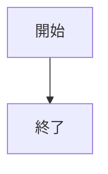
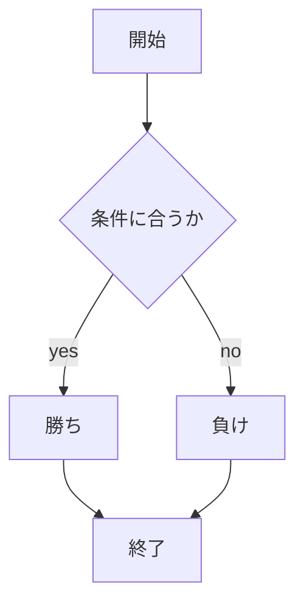

# webpro_06
## このプログラムについて
### ファイル一覧

ファイル名 | 説明
-|-
app5.js | プログラム本体
public/janken.html | じゃんけんの開始画面
janken.ejs | じゃんけんの画面

```javascript
console.log('Hello');
```

1. app5.jsを起動する
1. webブラウザでlocalhost:8080/public/janken.htmlにアクセスする
1. 自分の手を入力する



```すごいね!!!```



# 課題
```add5.js```には以下のようなプログラムがある
プログラム名 | 説明
-|-
hello1 | ```Hello world```と```Bon jour```を出力
hello2 | ```greet1```と```greet2```に格納された文字列を出力する．文字はhello1と同じ
icon | りんごのロゴを表示
luck | 1から6の中で乱数を生成し，１なら大吉，2なら中吉を出力する
janken | 1から3の乱数を取得し，1ならグー，2ならチョキ，3ならパーをcpuの手とする．ユーザーにグー，チョキ，パーのいずれかの文字を入力させ，じゃんけんのルールにしたがって勝敗を決める

それぞれのプログラムについて説明していく
## hello1
hello1は```message1```と```message2```にそれぞれ```Hello world```と```Bon jour```の文字列を格納し，
```show.ejs```表示するプログラムである．

## hello2
hello2は文字列```Hello world```と```Bon jour```を直接表示させるプログラムである．
hello1と異なる点は，hello1は一度```message```に文字列を格納してから```show.ejs```で表示させているのに対して，
hello2は文字列をそのまま```show.ejs```で表示させている．

## icon
iconは```filename```にりんごのロゴのファイル名を格納し，```icon.ejs```でそのファイルを表示している．

## luck
luckではまず始めに1から6の乱数を生成する．乱数の値が1であったら```luck```に文字列の大吉を格納し，
2であったら中吉を格納する．```luck.ejs```では```luck```に格納された文字列と，乱数が正しく取得できているか
確認するため```num```を表示する．

## janken
jankenでは1から3の乱数を取得する．1ならグー，2ならチョキ，３ならパーを```cpu```に格納する．
ブラウザ上でユーザーにグー，チョキ，パーのいずれかの文字列を入力させ，じゃんけんのルールに従い
ユーザーとコンピューターの勝敗を決める．勝ちの場合は```win```と```total```に+1し，
それ以外の場合は```total```に+1をする．これによって戦績を表示できるようになる．