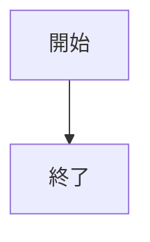
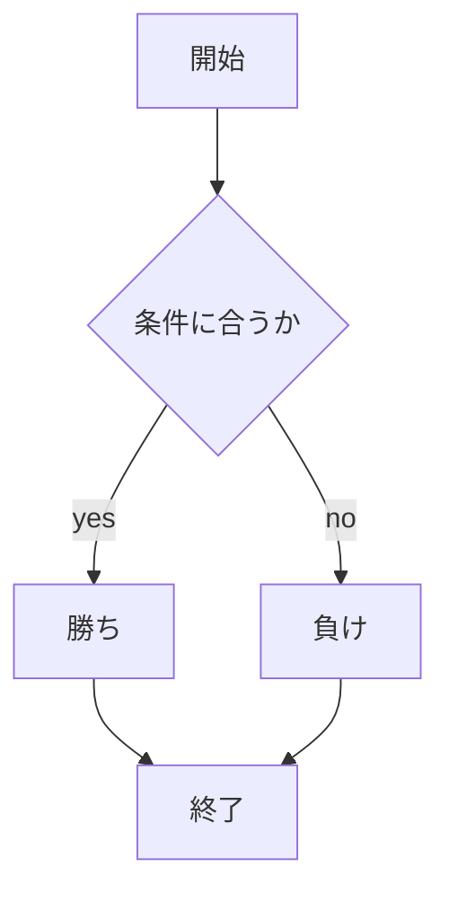

# webpro_06
## このプログラムについて
### ファイル一覧

ファイル名 | 説明
-|-
app5.js | プログラム本体
public/janken.html | じゃんけんの開始画面
janken.ejs | じゃんけんの画面

```javascript
console.log('Hello');
```

1. app5.jsを起動する
1. webブラウザでlocalhost:8080/public/janken.htmlにアクセスする
1. 自分の手を入力する



```すごいね!!!```



```add5.js```には以下のようなプログラムがある
プログラム名 | 説明
-|-|-|-|-|-
hello1 | ```Hello world```と```Bon jour```を出力
hello2 | ```greet1```と```greet2```に格納された文字列を出力する．文字は```hello1```と同じ
icon | りんごのロゴを表示
luck | 1から6の中で乱数を生成し，１なら大吉，2なら中吉を出力する
janken | 1から3の乱数を取得し，1ならグー，2ならチョキ，3ならパーをcpuの手とする．
ユーザーにグー，チョキ，パーのいずれかの文字を入力させ，じゃんけんのルールにしたがって勝敗を決める