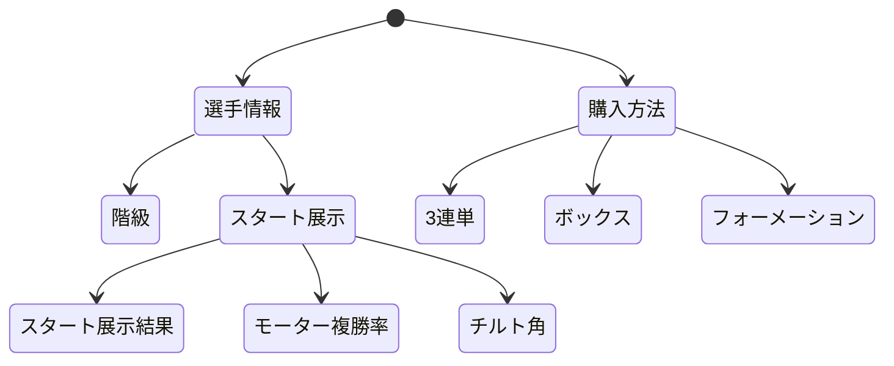
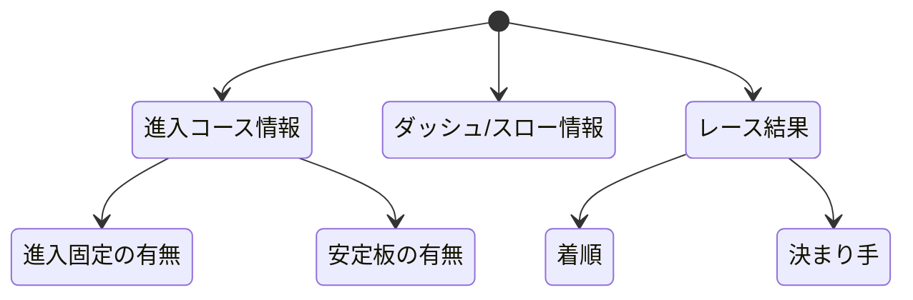
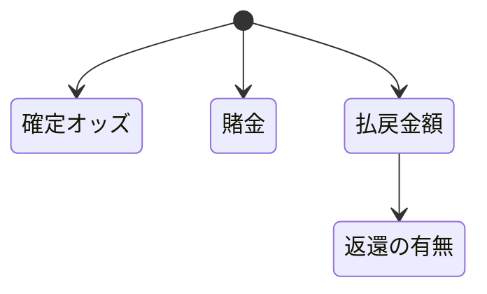

# 開発者用仕様書(仮)
本仕様書は，舟券発売システム，疑似レースシステム，払戻システムの3種のシステムについての仕様書である．以下にそれぞれのシステムについて詳細な概要を示す．
## システム概要
### 舟券発売システム
舟券発売システムは，利用者が3連単，ボックス，フォーメーションの中から任意の方法で舟券を購入できるシステムである．各舟券に賭ける金額も設定でき，購入方法，賭金に応じて最終的な購入金額が表示されるというシステムである．

### 疑似レースシステム
疑似レースシステムは，乱数によって1から6番までの艇の着順を決定するシステムである．
着順が決定した後，事前に設定された情報によってオッズを確定させ表示する．

### 払戻システム
払戻システムは購入した組み合わせ，着順，賭金，オッズを入力すると，それに応じて的中かどうかの判定と払戻金額の表示が行われる．

## 各システムのデータ構造
以下に各システムのデータ構造を示す．
### 舟券発売システムのデータ構造
```text
- 選手情報
    - 階級
    - スタート展示
        - スタ展結果
        - モーター複勝率(2連率)
        - チルト角
```

### 疑似レースシステムのデータ構造
```text
- 進入コース情報
    - 進入固定の有無
    - 安定板の有無
- ダッシュ/スロー情報
- レース結果
    - 着順
    - 決まり手
```

### 払戻システムのデータ構造
```text
- 確定オッズ
- 賭金
- 払戻金額
    -返還艇の有無
```

## ページ遷移について
以下のフローチャート図に示すようにページ遷移を行う
### 舟券発売システムのページ遷移


### 疑似レースシステムのページ遷移


### 払戻システムのページ遷移


## システムごとの詳細な説明
### 舟券発売システムの詳細な説明
舟券発売システムはまず利用者が3連単，ボックス，フォーメーションの3つの購入方法から1つを選択し，それぞれの購入方法に合わせたページへと遷移する．利用者が着順をボタンで選び賭金を入力，その後購入確定ボタンを押すと着順，金額が渡され計算をした後合計金額と購入した舟券の一覧を表示させる．1-1-1などの購入不可な組み合わせがある場合には購入確定ボタンを押すと無効な購入であるという表示をする．

### 疑似レースシステムの詳細な説明
疑似レースシステムは進入コース情報，ダッシュ/スロー情報，レース結果の3つの項目があり，進入コース情報では進入固定の有無，安定板の有無を，ダッシュ/スロー情報ではどのように6艇がスタートするか，レース結果は上位3艇の着順と決まり手を表示させる．これらの結果は乱数によって決定する．

### 払戻システムの詳細な説明
払戻システムは着順とそれに紐付いたオッズを表示させ，利用者が賭金を入力することでいくら払戻があるかを表示させる．現段階では他システムとの連携は想定しないものとする．